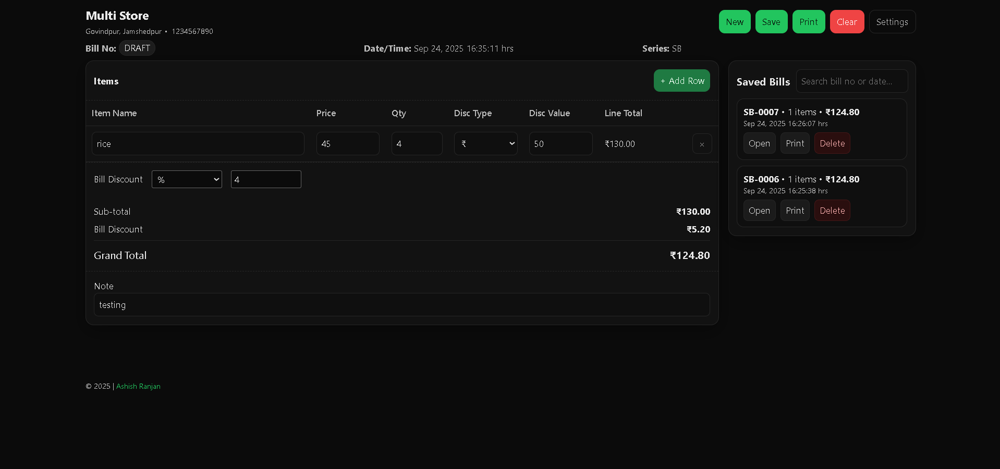

# Shop Billing



Minimal **vanilla JS** billing app for small shops - add items, per-item & bill-level discounts, auto-save to localStorage, printable slip.

## Live & Repo

-   **Live:** https://a2rp.github.io/shop-billing/
-   **GitHub:** https://github.com/a2rp/shop-billing

## Features

-   Item rows: **Name, Price, Qty, Discount (₹ / %)** → Line Total
-   **Bill-level discount** (₹ / %) and **Grand Total**
-   **Auto-save draft** + **Saved Bills history** (open/print/delete)
-   **Print-ready** A5/A4 slip

## Clone & Use

```bash
# 1) Clone
git clone https://github.com/a2rp/shop-billing.git
cd shop-billing

# 2) (Option A) Just open the app
#    Open index.html in your browser (or use VS Code "Live Server")

# 2) (Option B) If you edit SCSS, compile to CSS (optional)
#    Requires Dart Sass: https://sass-lang.com/install
sass --watch style.scss:style.css
```
